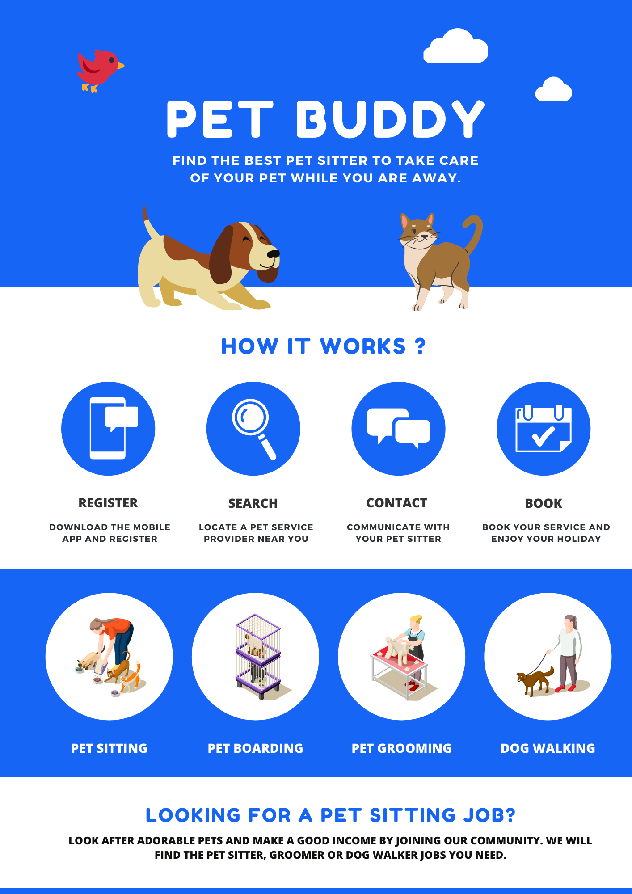
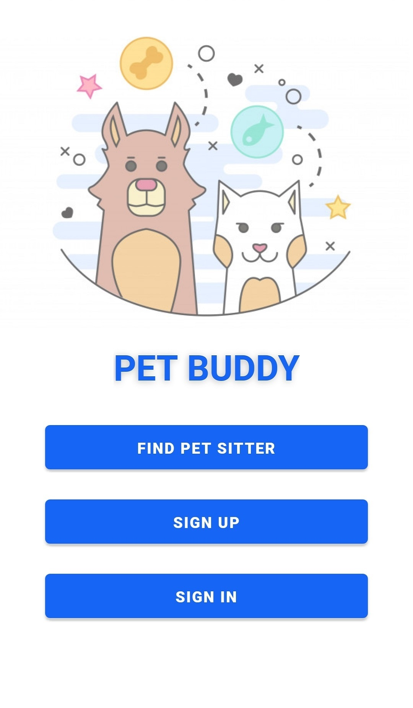
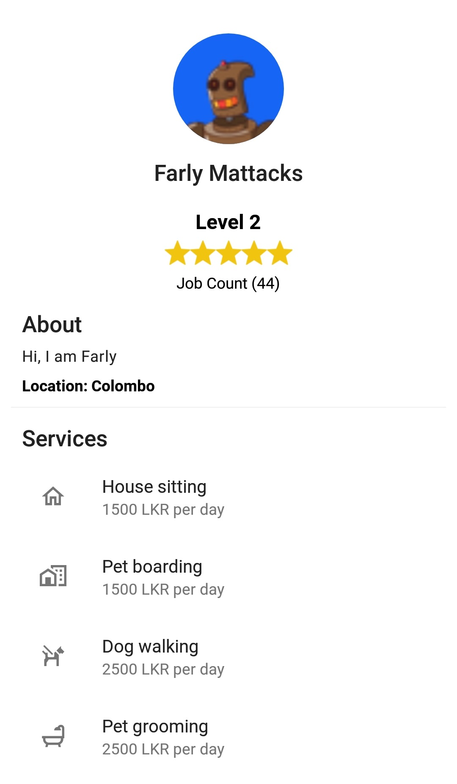
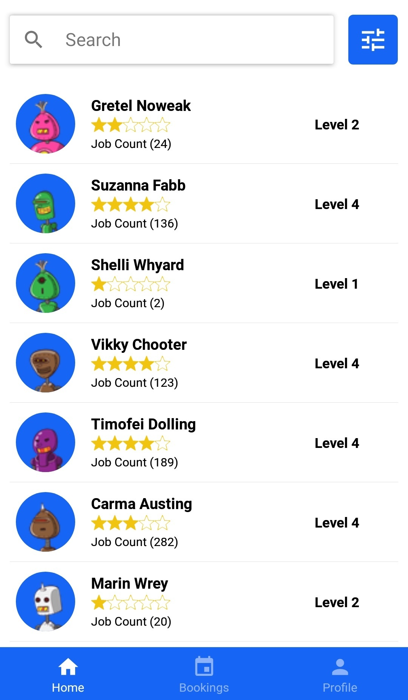

<p align="center"><sub><i>Created using Canva | Graphic resources from Canva and Freepik (<a href="http://www.freepik.com">macrovector</a>)</i></sub></p>


# Pet Buddy

## Summary
<div align="justify">
Pet Puddy is a cloud-based mobile application that will act as a platform for both pet owners and service providers. This allows pet owners to find pet sitters and other pet related services easily. A user is required to login or register an account as a pet owner or a service provider in order to gain access to all the features provided by this app. Pet owners can search and book any service listed by other users. Pet owners should provide the date and the information about the pet when making a booking. Information about pets can be stored so that it does not require to re-enter the details of each pet every time. The pet owner and the service provider can communicate using the built-in messaging feature easily. The system allows pet owners to rate service providers after they complete their service. This system provides unique features such as user levels. Service providers will be assigned a level based on the number of total jobs and the overall rating. By completing more jobs and getting better ratings will allow service providers to level up.
Administrators have a seperate web application which will allow them to manage the system easily. Administrators can monitor the system status and view details of the users and the bookings.
</div>

## Screenshots

  

[More screenshots](https://github.com/bandaranayake/petbuddy/wiki)

## Getting Started

### Prerequisites
Install the latest versions of [Node.js](https://github.com/nodejs/node), [React Native](https://github.com/facebook/react-native) and [React](https://github.com/facebook/react)

### Installing

1. Clone the respository:

    ```
    git clone git@github.com:bandaranayake/petbuddy.git
    ```

2. Select one Project:

    **Select Android Application**
    ```
    cd petbuddy-app
    ```
    
    **Select Admin Dashboard**
    ```
    cd petbuddy-admin-web
    ```
    
    **Select Cloud Functions**
    ```
    cd petbuddy-api
    ```
3. Update Firebase Configurations

    **Android Application**

    + Rename `android\app\google-services.example.json` to `android\app\google-services.json`
    
    + Download the [configuration file](https://support.google.com/firebase/answer/7015592?hl=en#android) from Firebase console and update the `google-services.json`
   
    **Admin Dashboard**

    + Rename `.env.example` to `.env`
    
    + Add following configurations,
    ```
    REACT_APP_API_KEY
    REACT_APP_AUTH_DOMAIN
    REACT_APP_DATABASE_URL
    ```
    
    **Cloud Functions**

    + Rename `.env.example` to `.env`
    
    + Add following configurations,
    ```
    REACT_APP_DATABASE_URL
    ```

    + Rename `credentials.example.json` to `credentials.json`
    
    + Add Firebase Service Account details

3. Install packages:

    **Using npm**
    ```
    npm install
    ```
    
    **Using yarn**
    ```
    yarn
    ```
4. Run:

    **Android Application**
    
    **(i) via USB**
    
    **Using npm**
    ```
    npm start
    ```
    
    **Using yarn**
    ```
    yarn start
    ```
    
    **(ii) via WiFi**
    
    [How to install and debug react-native app without USB](https://gist.github.com/bansalayush/fa6f28235438592d713ce600fe49c305)
    
    **Admin Dashboard**
    
    **Using npm**
    ```
    npm start
    ```
    
    **Using yarn**
    ```
    yarn start
    ```
    
    **Cloud Functions**
    ```
    firebase serve
    ```
    
## Deploying
### Android Application
Build the app

- Create a release build

```
cd android && gradlew assembleRelease
```

- Create a debug build

```
yarn android
```

### Admin Dashboard
This project is hosted on firebase. React app should be build inorder to deploy.

1. Build the App

   **Using npm**
   ```
   npm run build
   ```
   **Using yarn**
   ```
   yarn build
   ```

2. Deploy to Firebase

   ```
   firebase deploy --only hosting
   ```

### Cloud Functions
Deploy to Firebase

   ```
   firebase deploy --only functions
   ```

## Docker
### Android Application
1.  Change the current working directory to ```petbuddy-app```

```
cd petbuddy-app
```

2. Build the image

```
docker build -t petbuddy-app .
```

3. Create and start the container

```
docker run -tp 8081:8081 petbuddy-app
```

4. Build and run the app

- Create a release build

```
cd android && ./gradlew assembleRelease
```

- Install and debug the app on a device via Wifi

Connect the device via USB to the host computer and run the following command on the host computer

```
adb tcpip <port-number>
```

Remove USB and run the following commands inside the container

```
adb connect <device-ip>:<port-number>
```

```
yarn android
```

Change bundle location on the device to 

```
<host-ip>:8081
```

### Admin Dashboard
1.  Change the current working directory to ```petbuddy-admin-web```

```
cd petbuddy-admin-web
```

2. Build the image

```
docker-compose up
```

3. Create and start the container

```
docker run -tp 3000:3000 <image-name>
```

## Built With

* [React Native](https://github.com/facebook/react-native)
* [React](https://github.com/facebook/react)
* [Express](https://github.com/expressjs/express)
* [FireBase](https://firebase.google.com)